#  FlowDelivery

<p align="center">
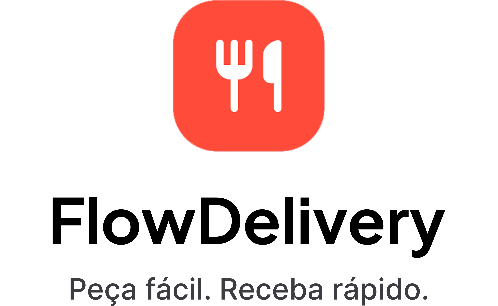
</p>

Portfolio-grade Flutter food delivery application built with MVVM architecture, Supabase backend integration, and scalable software engineering practices.

---

# 🌐 Live Demo

**▶️ https://leomoraesitu.github.io/flowdelivery-app/**

The Flutter web build is deployed to GitHub Pages and serves the `v0.2.0` read-only catalog browsing experience: sign in, then browse the Home feed, restaurant details, and product details backed by Supabase. The deploy runs automatically on each version tag (`v*.*.*`).

> Sign-in/recovery require the Supabase Auth URL allow-list to include the Pages origin. An Android APK is also published with every release under [Releases](https://github.com/leomoraesitu/flowdelivery-app/releases).

## 🎬 Cart Demo (Sprint 9)

<p align="center">
  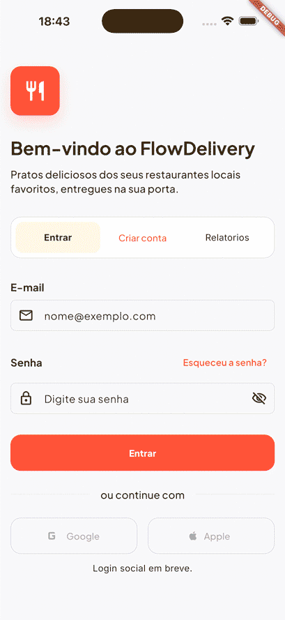
</p>

---

# 📱 Overview

FlowDelivery is a modern delivery platform developed as a portfolio-grade software engineering project focused on:

- Flutter cross-platform development
- MVVM architecture
- Clean Architecture principles
- Supabase backend integration
- Design System scalability
- AI-assisted development workflow
- CI/CD readiness
- Professional engineering conventions

As of `v0.2.0`, FlowDelivery ships a validated read-only catalog browsing experience (Sprints 2-8) on top of the Sprint 1 authentication foundation: authenticated Home feed, restaurant details, product details, deterministic catalog seed coverage, and Storage-backed catalog media — all served live on the web demo above and as a release APK. Sprint 9 added the first interactive commerce slice: a session-local shopping cart (add from product details, quantity controls, single-restaurant constraint, protected `/cart` page, and header badges), landing in the next release. PT-BR/EN localization, Theme Guard, and Localization Guard are enforced across presentation slices.

---

# 🎨 Prototype

<p align="center">
  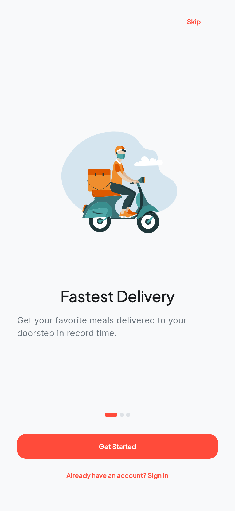
  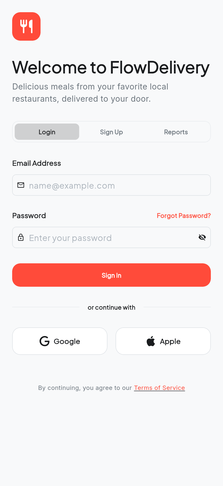
  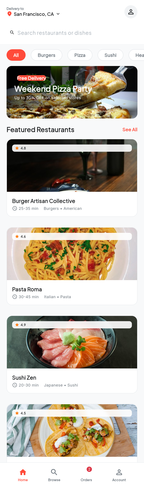
  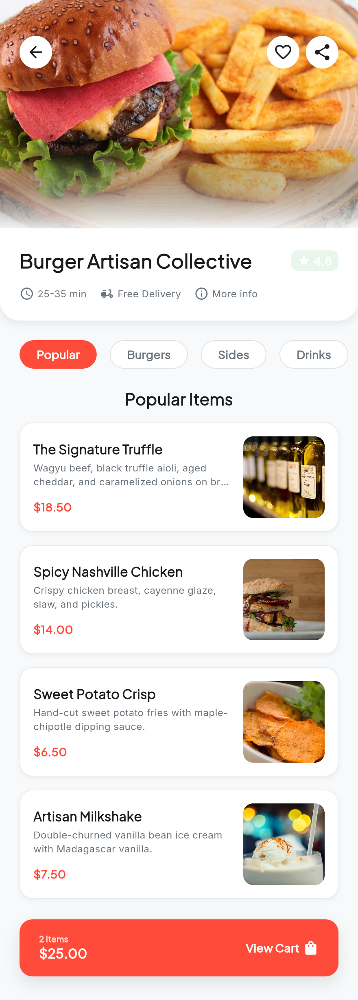
  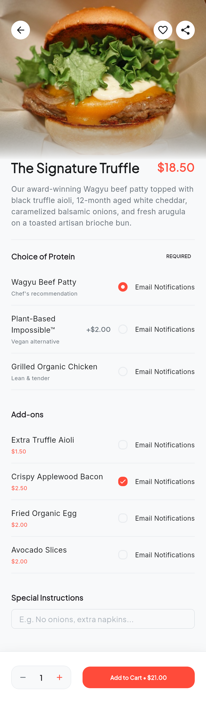
</p>

<p align="center">
  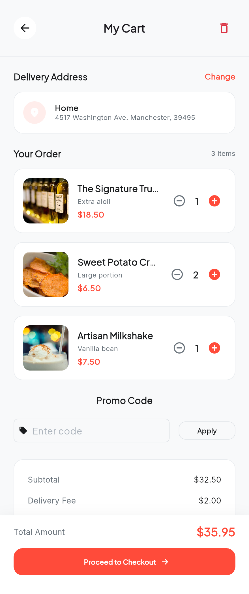
  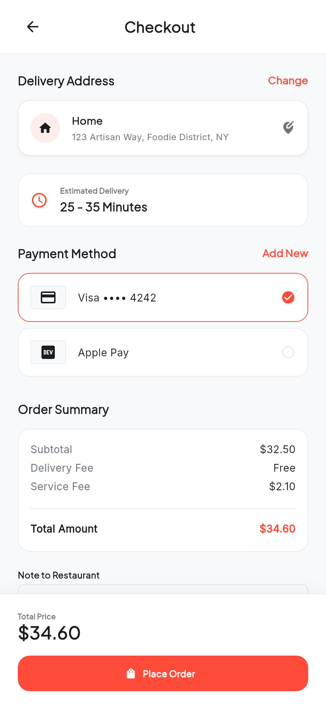
  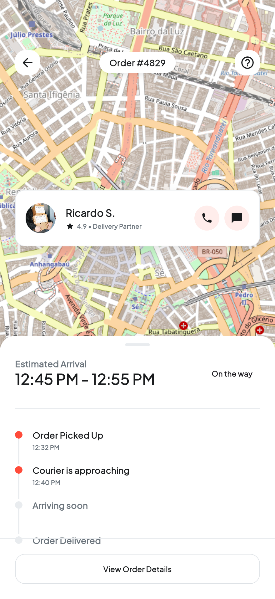
  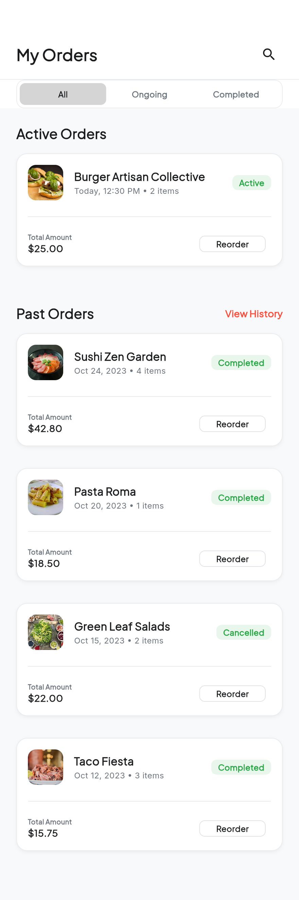
  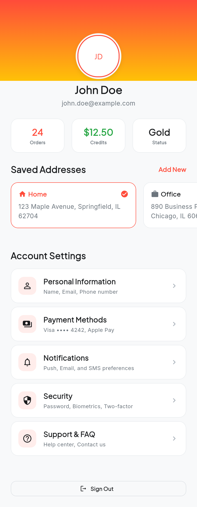
</p>

---

# 🚀 Tech Stack

## Frontend

- Flutter
- Dart
- Material 3
- MVVM Architecture

---

## Backend

- Supabase (integrated)
- PostgreSQL (integrated — catalog schema with RLS and grants)
- Authentication (implemented)
- Storage (integrated — public-read `catalog-media` bucket)
- Realtime (planned)

---

## Architecture & Engineering

- MVVM
- Repository Pattern
- Feature-first organization
- Design Tokens
- Initial light and dark app themes
- Conventional Commits
- Semantic Versioning
- CI/CD Ready

---

## AI-Assisted Development

This project uses AI-assisted workflows during development with explicit human approval gates.

- OpenAI Codex CLI
- GitHub Copilot
- Prompt Engineering
- Context-driven software generation
- Flutter/Dart agent skills in `.agents/skills`
- Persistent planning in `.ai/plans`

Recommended command loop:

```bash
./scripts/ai/ai_memory_loop.sh
```

(PowerShell equivalents remain available as `scripts/ai/*.ps1` for Windows.)

Operational flow:

1. `Morning Start` - recover project, sprint and feature context.
2. `Start Feature` - analyze architecture and tradeoffs before implementation.
3. `Technical Plan` - generate or update `.ai/plans/YYYY-MM-DD-<feature>-plan.md`.
4. `Continue Feature` - execute only the next pending task from the plan.
5. `Review Feature` - review MVVM, Clean Architecture, tests, naming and risks.
6. `Learning Mode` - explain architecture, Flutter concepts and tradeoffs.
7. `End Day` - persist progress, pending work, risks and technical debt.

AI workflow directories:

```text
.ai/
├── context/      # project context loaded by agents
├── memory/       # current sprint, feature and technical debt
├── plans/        # implementation plans tracked task by task
└── reviews/      # daily and feature reviews

.agents/skills/  # installed Flutter/Dart agent skills
.codex/commands/ # prompt commands copied by scripts/ai
.codex/workflows/# repeatable AI execution workflows
```

Rule of thumb: no feature implementation should start before a matching file exists in `.ai/plans`.

---

# 📂 Project Structure

```text
lib/
├── app/
│   ├── theme/
│   └── README.md
├── features/
│   └── README.md
├── shared/
│   └── README.md
└── main.dart
```

---

# 🧠 Architectural Principles

The project follows:

- Separation of Concerns
- Single Responsibility Principle
- Dependency Inversion
- Reactive State Management
- Scalable Feature Modules
- Clean UI Composition

---

# 🎨 Design System

FlowDelivery uses a scalable Design System strategy including:

- Semantic colors
- Typography tokens
- Spacing tokens
- Radius tokens
- Size and duration tokens
- Initial Material 3 light/dark theme placeholders
- Responsive layouts

---

# 📋 Planned Features

## Authentication

- Email/password login (implemented)
- Password recovery request (implemented)
- Social authentication (planned)
- Session persistence (planned)

---

## Restaurant Feed

- Featured restaurants
- Categories
- Search
- Filters

---

## Product Details

- Add-to-cart flow (implemented — in-cart quantity controls and single-restaurant dialog)
- Product customization (planned)
- Dynamic pricing (planned)

---

## Cart & Checkout

- Shopping cart (implemented — session-local, Sprint 9; persistence deferred to Checkout)
- Address selection (planned)
- Payment flow (planned)
- Order summary (planned)

---

## Orders

- Order tracking
- Order history
- Delivery status timeline

---

## Profile

- User information
- Addresses
- Payment methods
- Preferences

---

# 📸 Planned Screens

- Splash & Onboarding
- Authentication
- Home Feed
- Restaurant Details
- Product Details
- Cart
- Checkout
- Order Tracking
- Order History
- User Profile

---

# 🧪 Quality Assurance

Planned QA strategy includes:

- Unit tests
- Widget tests
- Integration tests
- Lint rules
- Static analysis
- CI validation pipelines

---

# 🔀 Git Conventions

This project follows:

- Conventional Commits
- Git Flow-inspired branching strategy
- Semantic Versioning

Example:

```bash
feat(cart): implement cart state management
```

---

# 📚 Documentation

Project documentation is organized under:

```text
docs/
├── architecture/
├── ai/
├── design-system/
├── project-management/
├── setup/
├── qa/
└── releases/
```

---

# ⚙️ Environment Strategy

Planned environments:

- Development
- Staging
- Production

Configuration management will include:

- Environment variables
- Secure secrets management
- Build flavors
- CI/CD pipelines

---

# 🛠️ Getting Started

## Prerequisites

- Flutter SDK
- Dart SDK
- VS Code
- Android Studio
- Supabase account

---

## Clone repository

```bash
git clone https://github.com/leomoraesitu/flowdelivery-app.git
```

---

## Install dependencies

```bash
flutter pub get
```

---

## Run application

```bash
flutter run
```

---

# 📈 Roadmap

## Phase 1 — Foundation

- [x] Project setup
- [x] MVVM structure documented
- [x] Design System documentation
- [x] Routing strategy documented and runtime implementation deferred
- [x] Theme architecture

---

## Phase 2 — Core Features

- [x] Authentication
- [x] Home feed (remote, with search and category discovery)
- [x] Restaurant details
- [x] Product details
- [x] Storage-backed catalog media
- [x] Web demo deployed to GitHub Pages

---

## Phase 3 — Commerce

- [x] Cart (session-local, Sprint 9)
- [ ] Checkout
- [ ] Payments
- [ ] Orders

---

## Phase 4 — Production Readiness

- [ ] Tests
- [ ] CI/CD
- [ ] Analytics
- [ ] Monitoring
- [ ] Release pipelines

---

# 👨‍💻 Author

Leonardo de Moraes Souza

Flutter Developer • Mobile Engineer • AI-Assisted Software Development

- GitHub: https://github.com/leomoraesitu
- LinkedIn: https://linkedin.com/in/leomoraesitu

---

# 📄 License

This project is licensed under the MIT License.
